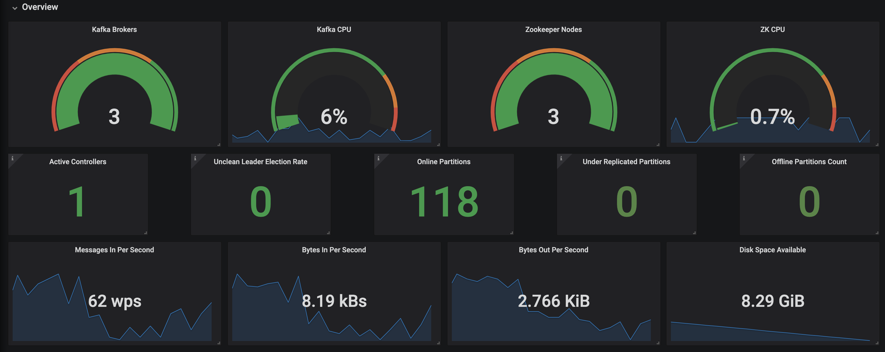
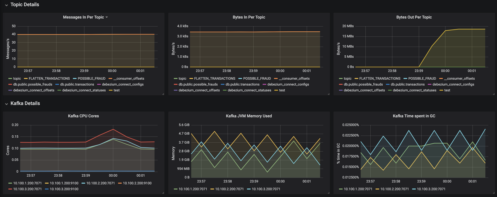
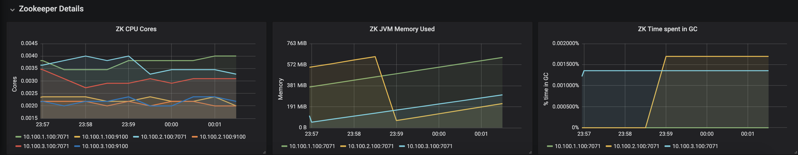

In [part 1](https://excellalabs.com/talks/apache-kafka-automation-part-1-zookeeper-service/), we covered how we can automate Zookeeper and deploy it as a service, in [part 2](https://excellalabs.com/talks/apache-kafka-automation-part-2-kafka-service/), we discussed how we can deploy Apache Kafka on AWS in a fully automated and self-healing manner. Now let's talk about operation! The challenge is, now that we have a fully automated Streaming Platform, how we know if a Kafka broker or a Zookeeper node is healthy or not and how we know about the number of healthy Kafka brokers or Zookeeper nodes.

With [Control Center](https://www.confluent.io/confluent-control-center/), one of the [Confluent Platform Enterprise](https://www.confluent.io/product/confluent-platform/) components,  you get a very cool dashboard for monitoring, managing Kafka, Zookeeper and other Confluent components. However, the Control Center is not free and it is somehow pricey!

In this blog post, I am going to show you step-by-step how you can achieve the goal to have a very cool monitoring dashboard with all open source tools and libraries.

### Requirements
Here is the list of tools and libraries that we need to achieve our goal:
1. [Prometheus](https://prometheus.io); an open-source system monitoring and alerting toolkit originally built at SoundCloud.
2. [Node Exporter](https://github.com/prometheus/node_exporter); for hardware and OS metrics with pluggable metric collectors. It allows measuring various machine resources such as memory, disk, and CPU utilization.
3. [Grafana](https://grafana.com/); an open-source metric analytics & visualization suite. It is most commonly used for visualizing time series data for infrastructure and application analytics but many use it in other domains including industrial sensors, home automation, weather, and process control.

Now let's dive into each tool and talk about how we can set them up.

## Prometheus
For automating the process of installation, we can use [this Chef cookbook](https://supermarket.chef.io/cookbooks/prometheus-platform), however for simplicity, I will show you how to install it by some shell command:


The first thing we need is an EC2 instance, create an Ubuntu 16.04 EC2 instance on AWS and ssh into it. We can use [this cookbook](https://supermarket.chef.io/cookbooks/prometheus-platform) to automate the process of installation Now we are ready to install and configure the Prometheus:

### Downloading Prometheus
From the Prometheus [download](https://prometheus.io/download/) website, download and set up the latest stable version:
```sh
$ wget https://github.com/prometheus/prometheus/releases/download/v2.11.1/prometheus-2.11.1.linux-amd64.tar.gz

# compare the checksum
$ sha256sum prometheus-2.11.1.linux-amd64.tar.gz

# untar 
$ tar xvf prometheus-2.11.1.linux-amd64.tar.gz
```
### Creating users and service
```sh
# create prometheus user
$ sudo useradd --no-create-home --shell /bin/false prometheus

# create the necessary directories
$ sudo mkdir /etc/prometheus
$ sudo chown prometheus:prometheus /etc/prometheus
$ sudo mkdir /var/lib/prometheus
$ sudo chown prometheus:prometheus /var/lib/prometheus
```

### Setting Prometheus up
```sh
# copy the binary files to the bin folder
$ sudo cp prometheus-2.11.1.linux-amd64/prometheus /usr/local/bin/
$ sudo cp prometheus-2.11.1.linux-amd64/promtool /usr/local/bin/

# change tht ownership to prometheus user
$ sudo chown prometheus:prometheus /usr/local/bin/prometheus
$ sudo chown prometheus:prometheus /usr/local/bin/promtool

# set consoles and console_libraries
$ sudo cp -r prometheus-2.11.1.linux-amd64/consoles /etc/prometheus
$ sudo chown -R prometheus:prometheus /etc/prometheus/consoles
$ sudo cp -r prometheus-2.11.1.linux-amd64/console_libraries /etc/prometheus
$ sudo chown -R prometheus:prometheus /etc/prometheus/console_libraries

# cleanup
rm -rf rm -rf prometheus-2.11.1.linux-amd64*
```
### Configuring Prometheus
Create `prometheus.yml` file in the folder `/etc/prometheus` and copy this content:
```yaml
global:
  scrape_interval: 15s

scrape_configs:
  - job_name: 'prometheus'
    scrape_interval: 5s
    static_configs:
      - targets: ['localhost:9090']
```

Now change the ownership of the file to newly created user `prometheus`:
```sh
$ sudo chown prometheus:prometheus /etc/prometheus/prometheus.yml
```

### Running Prometheus
Create `prometheus.service` file in the folder `/etc/systemd/system` and copy this content:
```
[Unit]
Description=Prometheus
Wants=network-online.target
After=network-online.target

[Service]
User=prometheus
Group=prometheus
Type=simple
ExecStart=/usr/local/bin/prometheus \
    --config.file /etc/prometheus/prometheus.yml \
    --storage.tsdb.path /var/lib/prometheus/ \
    --web.console.templates=/etc/prometheus/consoles \
    --web.console.libraries=/etc/prometheus/console_libraries

[Install]
WantedBy=multi-user.target
```
 Reload systemd by running:
```sh
$ sudo systemctl daemon-reload
``` 
Finally, enable and start the service on boot:

```sh
$ sudo systemctl start prometheus
$ sudo systemctl enable prometheus
```

Now if you browse to the host with port `9090` (http://<ec2_ip_address>:9090) you should see the welcome/landing page.

**Please note;** Prometheus does not have built-in authentication, instead you can use `nginx` to add basic HTTP authentication.

## Node Exporter
For collecting metrics from any EC2 instances such as Kafka brokers and Zookeeper nodes, we need to install `Node Exporter`. To do that, we just need to install package `prometheus-node-exporter` form apt repository, manually by running:
```sh
$ sudo apt update
$ sudo apt install prometheus-node-exporter
```

Or using Chef in [Kafka](https://github.com/excellalabs/kafka) and [Zookeeper](https://github.com/excellalabs/zookeeper) cookbooks:
```ruby
package 'prometheus-node-exporter' do
  action :install
end
```

To verify:
```sh
$ curl http://<host-ip-address>:9100/metrics
```

Alright, at this point, we can assume that the node exporter is running on all Zookeeper and Kafka brokers. In the following, I am going to cover the Zookeeper and Kafka configuration for Prometheus and Node Exporter.

## Server Metrics
There are two kinds of Metrics we should collect from Kafka brokers:

1. Internal metrics: JMX specific metrics, the default reporter, though we can add any pluggable reporter. Example: PartitionCount, UnderReplicatedPartitions, and OfflinePartitionsCount. Check [here](https://docs.confluent.io/current/kafka/monitoring.html) for the full list.  
2. Node Exporter metrics: hardware and operating system specific metrics, such as CPU, network and memory utilization. 

### Kafka Configuration 
First, Confirm the Node Exporter is installed and functional on port `9100`

Seconds, setup the JMX internal reporter:
1. Download the [java agent(https://repo1.maven.org/maven2/io/prometheus/jmx/jmx_prometheus_javaagent/0.6/jmx_prometheus_javaagent-0.9.jar)] jar file from maven repository and copy it under `/opt/prometheus/` folder:
    ```ruby
    # Prometheus jmx exporter
    directory '/opt/prometheus'

    prometheus_agent = 'https://repo1.maven.org/maven2/io/prometheus/jmx/' \
                       'jmx_prometheus_javaagent/0.6/' \
                       'jmx_prometheus_javaagent-0.6.jar'
    remote_file '/opt/prometheus/jmx_prometheus_javaagent-0.6.jar' do
      source prometheus_agent
    end
    ```
2. Create the configuration yaml file with the content from [here](https://github.com/excellalabs/kafka/blob/master/cookbooks/kafka-config/files/default/prometheus-kafka.yml). Here is the Chef source code:
    ```ruby
    cookbook_file '/opt/prometheus/kafka.yml' do
      source 'prometheus-kafka.yml'
    end
    ```
3. Set the [JAVA_OPS](https://github.com/excellalabs/kafka/blob/master/cookbooks/kafka-config/files/default/systemd/kafka_environment):
    ```ruby
    cookbook_file '/etc/default/kafka' do
      source 'systemd/kafka_environment'
      mode '0644'
    end
    ```
4. Set the environment file in the [/etc/systemd/system/kafka.service](https://github.com/excellalabs/kafka/blob/master/cookbooks/kafka-config/files/default/systemd/kafka.service) file:
    ```sh
    ...
    EnvironmentFile=/etc/default/kafka
    ...
    ```

Now from any broker, if you curl with host ip and port 7071 with url `/metrics` you should get the JMX metrics.

### Zookeeper Configuration
This should be very similar to Kafka Configuration in the previous section. The only difference is the Zookeeper environment [file](https://github.com/excellalabs/zookeeper/blob/master/cookbooks/zookeeper-config/files/default/systemd/zookeeper_environment), instead of `KAFKA_OPTS`, in Zookeeper, we have `EXTRA_ARGS`.
Note that, I tried to follow the naming convention for Kafka and Zookeeper. For instance, with Prometheus yaml file, here we have [prometheus.yml](https://github.com/excellalabs/zookeeper/blob/master/cookbooks/zookeeper-config/files/default/prometheus.yml). 

## Monitoring Other Components
For monitoring other Kafka/Confluent components like `kafka-consumers`, `ksql` or `kafka-connect` we can follow the same pattern if the services are hosted on EC2 instances. 
However, if you are a microservice enthusiast, you probably want to host these kinds of components on ECS or Kubernetes containers. If that is the case here is how you can easily achieve that.

### Kafka Connect hosted on ECS
1. Download the `jmx_prometheus_javaagent` inside the [container](https://github.com/excellalabs/debezium/blob/master/container/Dockerfile)
2. Create Prometheus [config.yml](https://github.com/excellalabs/debezium/blob/master/container/prometheus-config.yml) and copy it inside the [container](https://github.com/excellalabs/debezium/blob/master/container/Dockerfile)
3. Set the `KAFKA_OPTS` and `JMX_PORT` environment variable for the container:
    ```yaml
    ...
    ContainerDefinitions:
      PortMappings:
        - ContainerPort: !Ref Port
        - ContainerPort: 6001
      Environment:
        - Name: KAFKA_OPTS
          Value: -javaagent:/kafka/jmx_prometheus_javaagent.jar=7071:/kafka/config.yml
        - Name: JMX_PORT
          Value: 6001
    ...
    ```

Monitoring other Kafka or Confluent components such as KSQL, Schema Registry, Producers, Consumers, and etc, would be very similar to one of the component above, depends on the host, either EC2 instances or Container.

Now that we know how to gather metrics, it's time for visualization!

## Collecting Metrics
At this point, we have all the endpoints to call and get the metrics data, 

Now that we have all the `/metrics` endpoints, we need to configure the Prometheus to call these endpoint periodically for collecting the data. To do that, edit `/etc/prometheus/prometheus.yml` from Prometheus server with this content:
```yaml
global:
  scrape_interval: 15s

scrape_configs:
  - job_name: prometheus
    scrape_interval: 5s
    static_configs:
      - targets: ['localhost:9090']
  - job_name: kafka
    scrape_interval: 5s
    static_configs:
      - targets:
          - broker-1-ip:7071
          - broker-2-ip:7071
          - broker-3-ip:7071
          - broker-1-ip:9100
          - broker-2-ip:9100
          - broker-3-ip:9100
  - job_name: zookeeper
    scrape_interval: 5s
    static_configs:
      - targets:
          - zookeeper-1-ip:7071
          - zookeeper-2-ip:7071
          - zookeeper-3-ip:7071
          - zookeeper-1-ip:9100
          - zookeeper-2-ip:9100
          - zookeeper-3-ip:9100
  - job_name: debezium
    scrape_interval: 5s
    static_configs:
      - targets:
          - debezium-host-ip:7071
  - job_name: kafka-consumer
    scrape_interval: 5s
    static_configs:
      - targets:
          - kafka-consumer-host-ip:7071
```
And simply if you want to monitor more services, if you already setup exporter, just add it as a new job with proper properties. 

Okay, we have configured the backend with all data we needed. Now it is the time for visualization.

## Grafana
In this section, I am going to walk you through to setting up the visualization piece of what we have done. 

1. Install [Grafana](https://grafana.com/docs/installation/) on the local machine or pick an easier and better way, this [docker](https://hub.docker.com/r/grafana/grafana) image:
    ```sh
    $ docker run -d --name=grafana -p 3000:3000 grafana/grafana
    ```
2. Navigate to `localhost:3000` with default credentials (admin/admin)
3. From the left menu bar, navigate to Configuration -> Data Sources, and click on `Add data source` button, and add Prometheus data source. Add previously configured Prometheus url, and set it as default. 
4. From left menu bar, navigate to Dashboard -> Manage, click on `Import` button, and copy the content of [kafka-overview.json](https://github.com/excellalabs/grafana/blob/master/dashboards/kafka-overview.json) file, and paste it in the `paste JSON` box, and then click on `Load`
5. Showtime! Check `Kafka Overview` dashboard:

Kafka details:

Zookeeper details:


## conclusion
As you can see now, this gadget looks very professional and as far as the functionality, it is very promising. Here is the list of repositories that can help you to have CI/CD pipelines for deploying the Kafka ecosystem on AWS:

* https://github.com/excellalabs/kafka
* https://github.com/excellalabs/zookeeper
* https://github.com/excellalabs/debezium
* https://github.com/excellalabs/ksql
* https://github.com/excellalabs/kafka-consumer
* https://github.com/excellalabs/grafana
